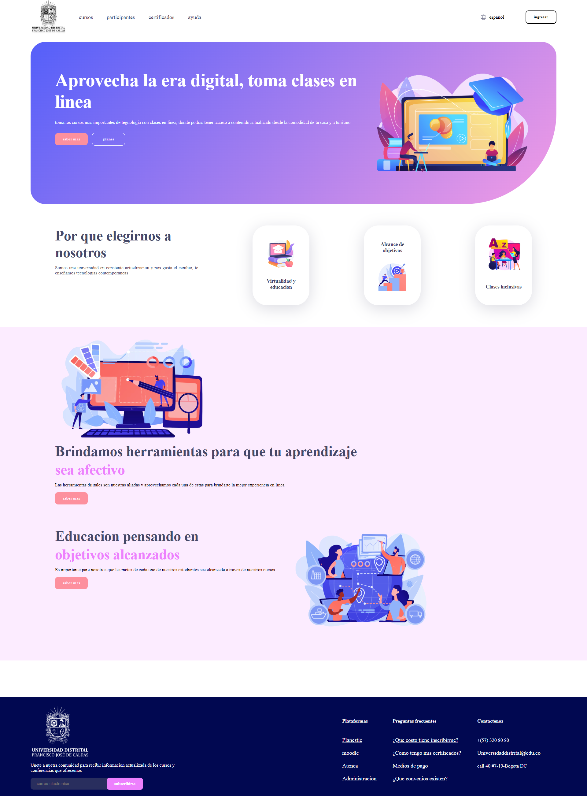

<h1>Taller 9 Sandra Johanna Garcia Ojeda</h1>

<h2> Información</h2>

Curso: full Stack Basico - Grupo 1

Profesor: Cristian Patiño

<h2>link pagina web<h2>
<a href="https://sandrajohannagarcia.github.io/taller-9-full-stack/"target="_black">link pagina web</a>

<h2> Punto 1: Link figma</h2>

<a href="https://www.figma.com/file/loYNHCtzEGDs8WxxweoPdo/SANDRA-JOHANNA-GARCIA-OJEDA?type=design&node-id=12%3A2&mode=design&t=KYg94NXV1SBni5xa-1" target="_blank">Link de Figma</a>

<h2>punto 2: HTML</h2>

<h2> punto 3: css</h2>
